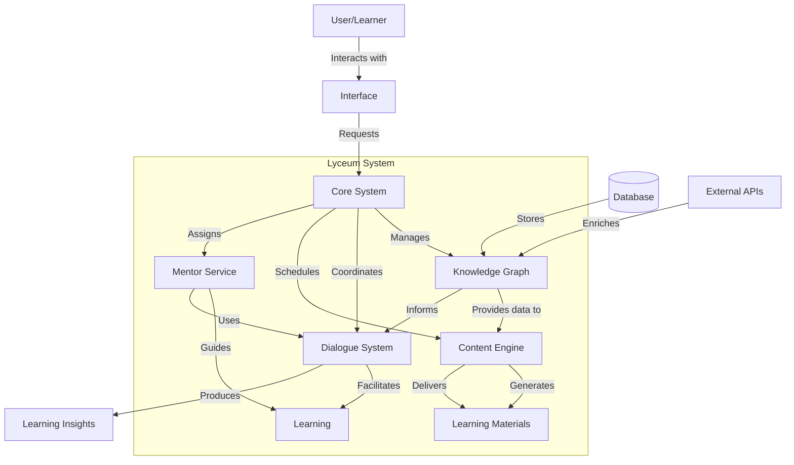
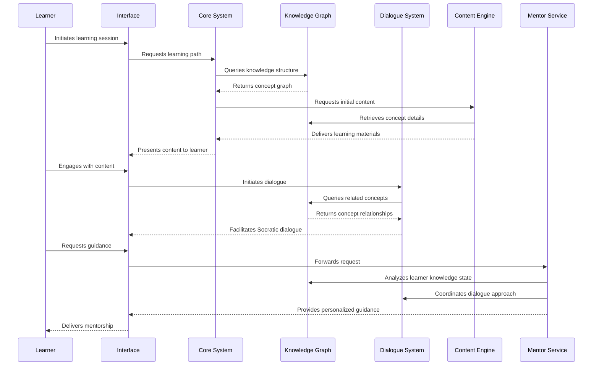
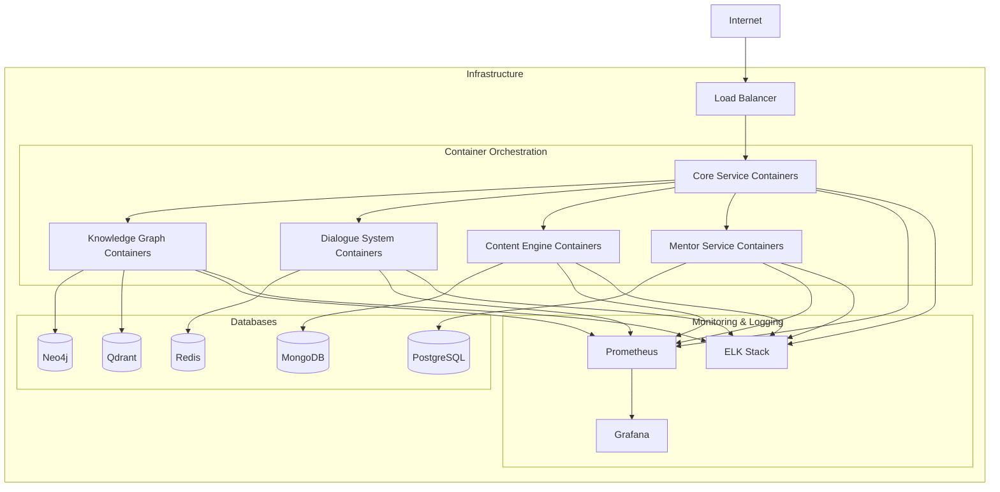
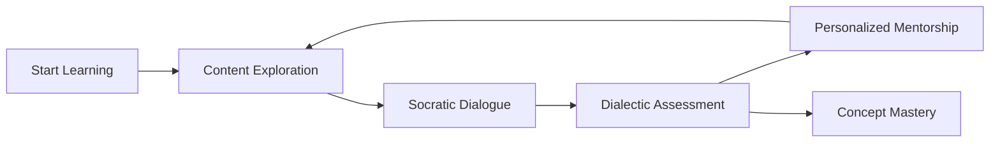

# Lyceum Educational System Design

## Overview

The Lyceum is a modern reinterpretation of ancient Greek learning centers, designed to facilitate deep learning through dialogue, exploration, and structured knowledge paths. This system is built on the foundation of the existing Goliath Educational Platform but extends it with specialized components focused on dialectic learning, mentorship, and philosophical inquiry.

## Design Philosophy

The Lyceum system embraces these core philosophical principles:

1. **Dialectic Learning**: Knowledge is best developed through structured dialogue and questioning
2. **Interconnected Knowledge**: Concepts form a web of understanding rather than isolated facts
3. **Guided Discovery**: Learning happens through exploration guided by experienced mentors
4. **Virtue-Oriented Education**: Education should develop not just knowledge but character virtues
5. **Community of Practice**: Learning flourishes in communities of shared inquiry

## System Architecture

The Lyceum builds upon the existing microservices architecture while introducing new components:

### Integration with Existing Services

The Lyceum system integrates with the existing Goliath Educational Platform components:

| Lyceum Component | Integrates With | Integration Point |
|-----------------|-----------------|-------------------|
| Knowledge Graph | Ptolemy | Extends the Neo4j + Qdrant knowledge service |
| Content Engine | Gutenberg | Enhances the content generation with dialectic patterns |
| Mentor Service | Galileo | Extends learning path recommendations with mentorship |
| Dialogue System | Socrates | Deepens the conversational capabilities |
| Core System | All Services | Orchestrates the integrated experience |

## Component Details

### Core System

The central orchestration layer that coordinates all aspects of the Lyceum.

**Responsibilities:**
- User session management and authentication
- Learning path coordination and progression tracking
- Service integration and communication
- Analytics and reporting on learning effectiveness
- Resource allocation and scheduling

**Technical Implementation:**
- Python-based FastAPI service
- Redis for session management
- PostgreSQL for transactional data
- RabbitMQ for inter-service communication

### Knowledge Graph

A connected network of concepts, representing relationships between ideas, prerequisites, and learning progressions.

**Responsibilities:**
- Concept management and organization
- Relationship mapping between concepts
- Knowledge exploration and navigation
- Semantic search and recommendation
- Philosophical concept hierarchy

**Technical Implementation:**
- Neo4j graph database backend
- Qdrant vector database for semantic search
- Python management services
- GraphQL API for complex queries

### Dialogue System

Facilitates Socratic conversations between learners and the system, guiding discovery through targeted questions.

**Responsibilities:**
- Socratic questioning and dialogue facilitation
- Concept exploration through conversation
- Dialectical analysis of learner understanding
- Adaptive question generation based on learner responses
- Philosophical inquiry patterns

**Technical Implementation:**
- LLM-powered dialogue management system
- Conversation state tracking
- Template-based Socratic patterns
- RAG (Retrieval-Augmented Generation) from knowledge graph

### Content Engine

Generates and adapts learning materials based on the knowledge graph and learner needs.

**Responsibilities:**
- Adaptive material generation
- Multimodal content creation (text, diagrams, interactive elements)
- Template-based creation with philosophical frameworks
- Responsive adaptation to learner progress

**Technical Implementation:**
- Enhanced Gutenberg service
- Template expansion with dialectic patterns
- Media generation for philosophical concepts
- Interactive dialectic exercises

### Mentor Service

Provides personalized guidance to learners, offering direction and assistance.

**Responsibilities:**
- Personalized guidance based on learning patterns
- Progress analysis and intervention
- Philosophical mentorship modeling
- Motivational support and virtue development

**Technical Implementation:**
- AI mentor profiles with philosophical approaches
- Learning analytics integration
- Intervention strategy framework
- Progress visualization tools

## Data Flow

The sequence of interactions within the Lyceum system follows this pattern:

## Deployment Architecture

The Lyceum components will be deployed using containerized microservices:

## User Experience Flow

The learner experience follows a cyclical pattern of content, dialogue, and mentorship:

### User Persona Examples

1. **The Philosophical Explorer**
   - Engages deeply with dialogue
   - Seeks to understand interconnections
   - Values the "why" behind concepts

2. **The Practical Learner**
   - Focuses on applicable knowledge
   - Values structured progression
   - Seeks mentorship for specific goals

3. **The Academic Researcher**
   - Explores comprehensive knowledge graphs
   - Values citation and source material
   - Engages with multiple perspectives

## Development Roadmap

The development of the Lyceum system is planned in phases:

### Phase 1: Foundation (Months 1-3)
- Core system architecture design
- Knowledge graph extension for philosophical concepts
- Basic dialogue system integration
- Initial mentor service framework
- Integration with existing platform services

### Phase 2: Knowledge Integration (Months 4-6)
- Expanded philosophical concept ontology
- Enhanced relationship mapping
- Dialectic pattern templates
- Knowledge visualization tools
- Content template enrichment

### Phase 3: Dialogue Systems (Months 6-9)
- Advanced Socratic dialogue patterns
- Adaptive questioning frameworks
- Dialectical response analysis
- Conversation visualization
- Philosophical argument mapping

### Phase 4: Mentor AI (Months 9-12)
- Personalized mentor profiles
- Intervention strategy framework
- Learning analytics integration
- Virtue development frameworks
- Progress visualization tools

### Phase 5: Full Integration (Months 12-15)
- Complete system integration
- Performance optimization
- User experience refinement
- Advanced analytics
- Expanded content library

## Implementation Considerations

### Technical Stack

| Component | Primary Technologies |
|-----------|----------------------|
| Core System | Python, FastAPI, Redis, PostgreSQL |
| Knowledge Graph | Neo4j, Qdrant, GraphQL, Python |
| Dialogue System | Python, LangChain, OpenAI, Hugging Face |
| Content Engine | Python, Jinja, FastAPI, MongoDB |
| Mentor Service | Python, PyTorch, FastAPI, PostgreSQL |
| Frontend | React, D3.js, Tailwind CSS |

### Scalability Considerations

- Horizontal scaling of stateless services
- Caching layers for knowledge graph queries
- Read replicas for database scaling
- Content delivery network for learning materials
- Asynchronous processing for content generation

### Security Considerations

- OAuth2 authentication flow
- Role-based access control
- Data encryption at rest and in transit
- Personal data minimization
- Regular security audits

## Evaluation Metrics

The effectiveness of the Lyceum system will be measured through:

1. **Learning Effectiveness**
   - Concept retention rates
   - Transfer of learning to new domains
   - Problem-solving capability improvement

2. **Engagement Metrics**
   - Dialogue depth and breadth
   - Time spent in active learning
   - Return rate and session frequency

3. **Mentorship Quality**
   - Intervention effectiveness
   - Learner progress acceleration
   - Self-directed learning development

4. **System Performance**
   - Response time and latency
   - Scalability under load
   - Resource utilization efficiency

## Appendix: Philosophical Foundations

The Lyceum system is inspired by philosophical traditions that emphasize:

1. **Aristotelian Learning**: Education through inquiry, observation, and discussion
2. **Socratic Method**: Structured questioning to examine assumptions and clarify thinking
3. **Stoic Education**: Focus on character development alongside knowledge
4. **Community of Inquiry**: Learning as a collaborative, social process

These foundations inform both the system architecture and the learning methodology.